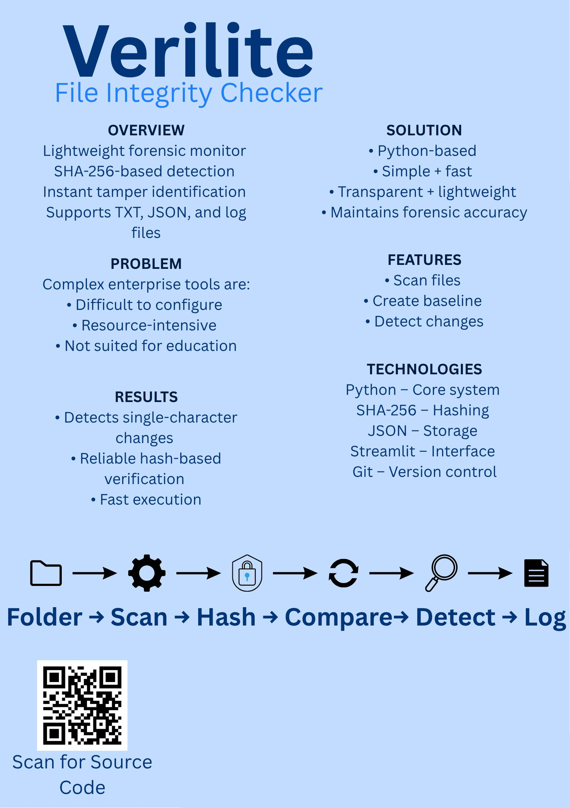

## VeriLite – Lightweight File Integrity - Theo Pakieser

### Abstract

VeriLite is a lightweight file integrity monitoring tool developed in Python to support digital forensics and system security. The system uses cryptographic hashing algorithms such as SHA-256 to generate baseline signatures of files and detect unauthorised modifications. Designed with simplicity and accessibility in mind, it provides forensic functionality without the complexity of enterprise solutions like Tripwire or AIDE. The tool supports baseline creation, verification, and change detection, while maintaining reproducible logs to support evidence integrity and chain-of-custody principles.

| | |
|-------|-------|
| **Project Number** | 39 |
| **Student Name** | Theo Pakieser |
| **Student ID** | W20101918 |
| **Supervisor** | Opeyemi Bamigbade |
| **Project Title** | VeriLite – Lightweight File Integrity |
| **Landing Page** | https://github.com/theopakieser/FinalYearProject2026 |
| **Programme** | BSc in Computer Forensics and Security |

