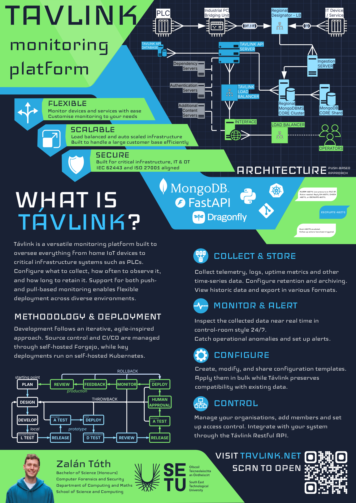

## Távlink - Zalán Tóth

### Abstract

Távlink is a multi-purpose SaaS monitoring platform to remotely oversee a wide range of devices and services across both IT and OT environments. You configure what and how you want to collect, enabling near real-time monitoring, alerting, and automated follow-up actions. Create and modify configuration templates and apply them at scale. Create organisations, add members, manage access control or even integrate into your system via the Távlink API. For sensitive and isolated environments, bridging software is available to connect even critical infrastructure safely to Távlink.

| | |
|-------|-------|
| **Project Number** | 41 |
| **Student Name** | Zalán Tóth |
| **Student ID** | W20102768 |
| **Supervisor** | Richard Lacey |
| **Project Title** | Távlink |
| **Landing Page** | https://tavlink.net |
| **Programme** | BSc in Computer Forensics and Security |

