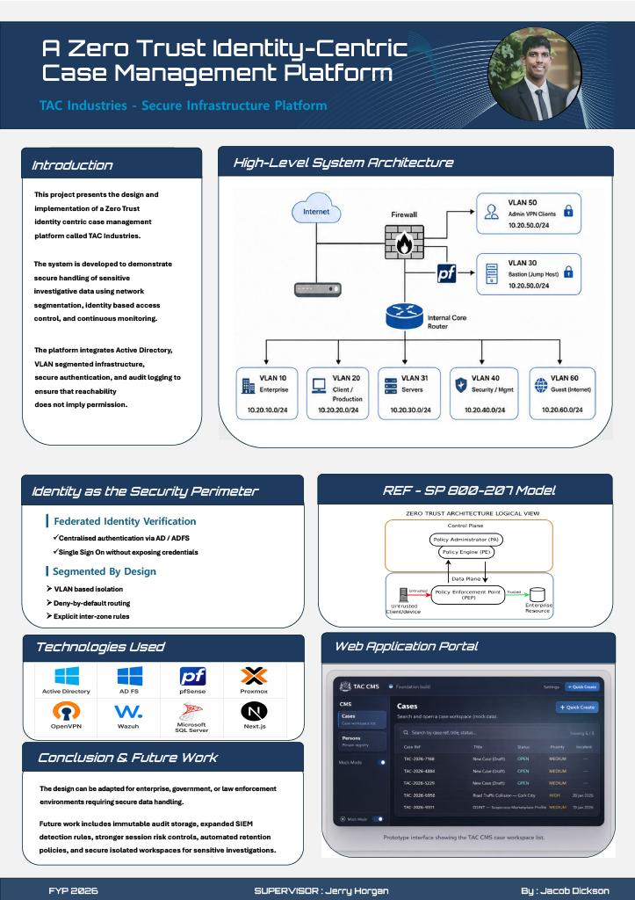

## TAC Zero Trust Case Management Platform - Jabez Dickson

### Abstract

This project presents the design and implementation of a Zero Trust identity centric case and subject registry for TAC Industries.  The system demonstrates secure handling of investigative data using network segmentation, federated identity, role based access control, and audit logging via SIEM.  The infrastructure includes VLAN isolated zones, Active Directory authentication, ADFS federation, and Virtual Machine technologies. It is a web based case management platform that validates the architecture and shows identity based security replacing traditional perimeter security.

| | |
|-------|-------|
| **Project Number** | 34 |
| **Student Name** | Jabez Dickson |
| **Student ID** | W20102440 |
| **Supervisor** | Jerry Horgan |
| **Project Title** | TAC Zero Trust Case Management Platform |
| **Landing Page** | https://github.com/JacobDicksonOfficial/TAC-Industries-Infra |
| **Programme** | BSc in Computer Forensics and Security |

