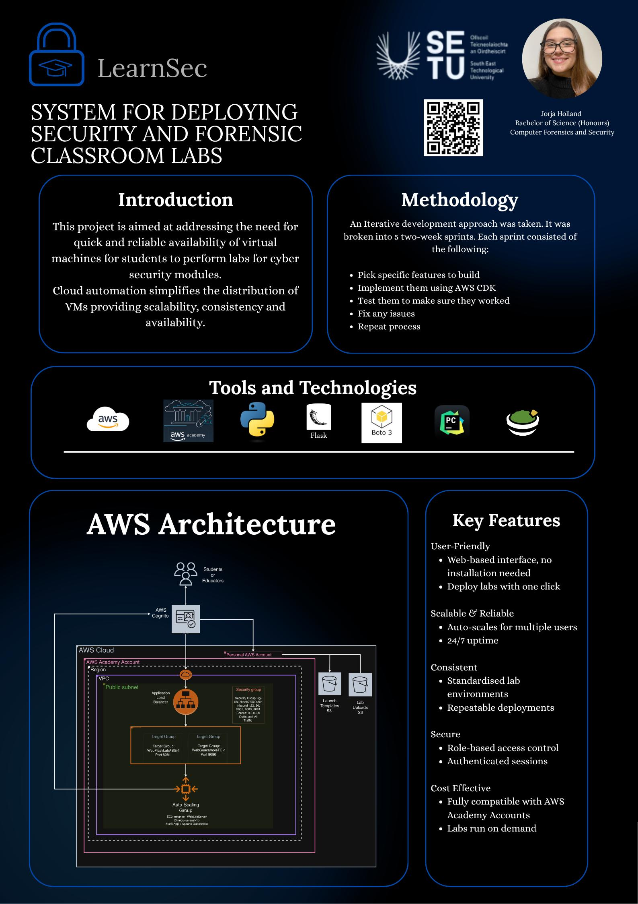

## LearnSec - Jorja Holland

### Abstract

LearnSec is a cloud-based system designed to simplify cybersecurity lab deployment for students. A web application built using Python (Flask) provides the user interface, while Boto3 is used to communicate with AWS services start and stop the lab environments in AWS Academy. A separate AWS account hosts AWS Cognito for user management and S3 buckets for storing lab content and launch templates, which are accessed by AWS Academy users. Apache Guacamole provides a browser-based desktop interface. Labs are created on demand, making the system cost-effective, scalable, and secure.

| | |
|-------|-------|
| **Project Number** | 36 |
| **Student Name** | Jorja Holland |
| **Student ID** | W20102340 |
| **Supervisor** | Jimmy McGibney |
| **Project Title** | LearnSec |
| **Landing Page** | https://jholland-22.github.io/websiteFYP/ |
| **Programme** | BSc in Computer Forensics and Security |

