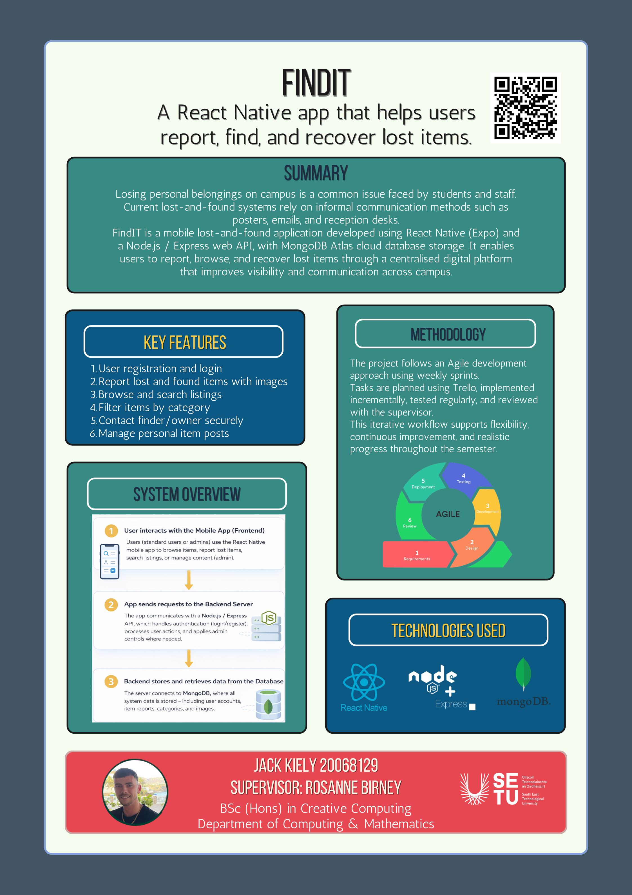

## FindIT: Campus Lost & Found App - Jack Kiely

### Abstract

Losing personal belongings on campus is a frequent issue experienced by students and staff, with current recovery methods relying heavily on informal communication such as posters, emails, and reception desks. This project presents mobile platform called FindIT that allows users to report lost or found items, browse listings, and improve recovery outcomes through the application. The system is developed using {React Native} for cross-platform mobile delivery, supported by a {Node.js} and {Express} web {API} with cloud data storage provided by {MongoDB Atlas}.

| | |
|-------|-------|
| **Project Number** | 45 |
| **Student Name** | Jack Kiely |
| **Student ID** | W20068129 |
| **Supervisor** | Dr Rosanne Birney |
| **Project Title** | FindIT: Campus Lost & Found App |
| **Landing Page** | https://github.com/JackKiely1/lost-and-found-webapp |
| **Programme** | BSc in Creative Computing |

