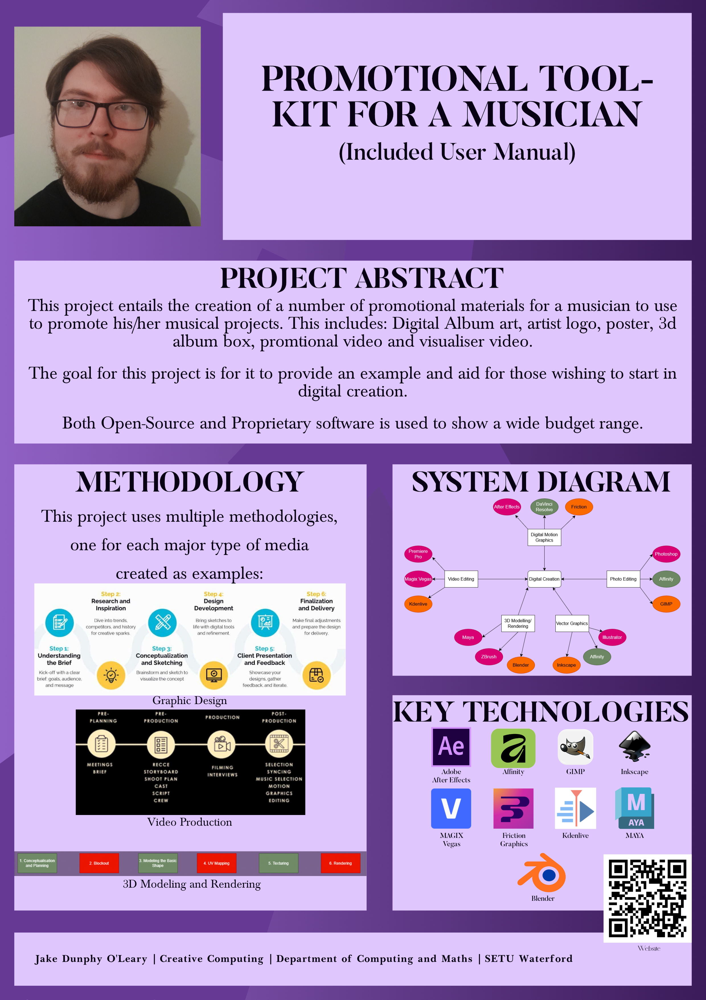

## Promotional Tool-kit for a Musician - Jake Dunphy O'Leary

### Abstract

This project entails the creation of a number of promotional materials for a musician to use to promote his/her musical projects. It includes:
•	Album box art (front, back and sides)
•	A digital cover for streaming services
•	An artist logo and banner (for use on social media and streaming sites)
•	A CD design
•	A promotional poster
•	A track list poster
•	Merchandise designs (t-shirts, hoodies and stickers are what will be made for this project).
The goal for this project is for it to provide an example and aid for those wishing to start in digital creation.

| | |
|-------|-------|
| **Project Number** | 43 |
| **Student Name** | Jake Dunphy O'Leary |
| **Student ID** | W20101923 |
| **Supervisor** | Brenda O'Neill |
| **Project Title** | Promotional Tool-kit for a Musician |
| **Landing Page** | https://jake-dunphy-fyp-site.carrd.co/ |
| **Programme** | BSc in Creative Computing |

