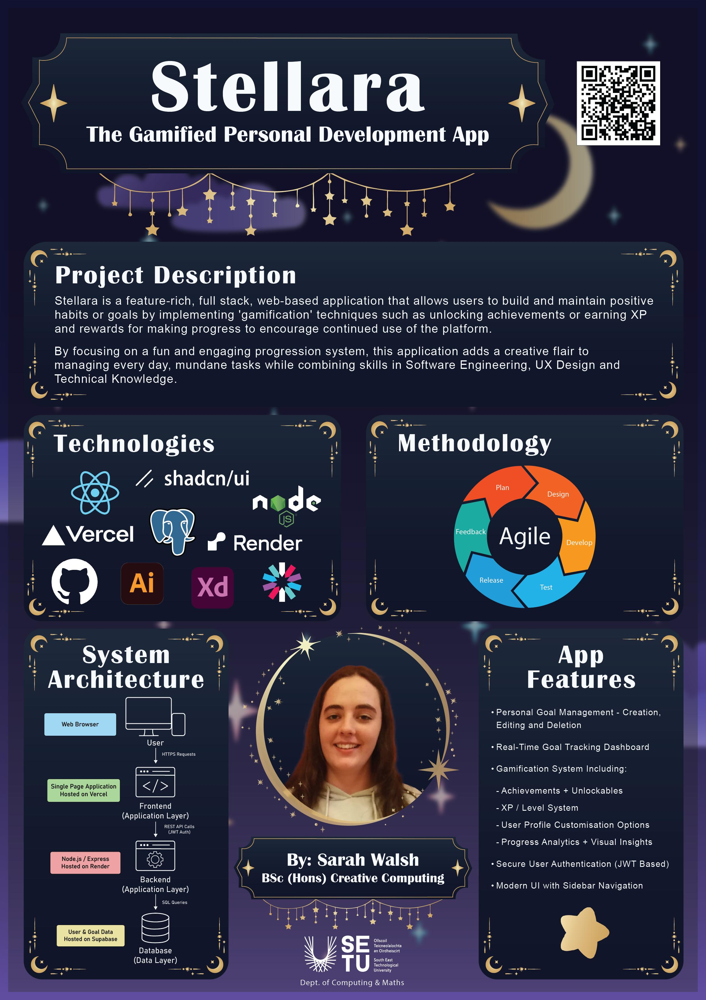

## Stellara - Sarah Walsh

### Abstract

Stellara is a full-stack web application that enables users to build and maintain positive habits and achieve personal goals through the utilisation of gamification techniques. Core features include achievements, an experience points (XP) system, and unlockable rewards to encourage productivity and continued use of the platform. By focusing on a fun and engaging progression system, this application adds a creative flair to managing every day, mundane tasks while combining skills in Software Engineering, UX Design and Technical Knowledge.

| | |
|-------|-------|
| **Project Number** | 47 |
| **Student Name** | Sarah Walsh |
| **Student ID** | W20102911 |
| **Supervisor** | Dr Rosanne Birney |
| **Project Title** | Stellara |
| **Landing Page** | https://fyp-gamified-personal-development-a.vercel.app/ |
| **Programme** | BSc in Creative Computing |

