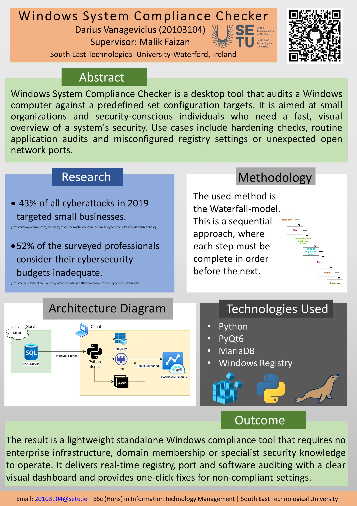

## CompliWin: Peace of Mind - Darius Vanagevicius

### Abstract

As cybersecurity threats against small businesses and individual users intensify maintaining proper
security in a Windows environment continues to increase in complexity and understanding especially
for non-expert computer users. The Windows Security Assessment Tool built using Python is
intended to solve this issue. It employs a client-server structure utilizing MariaDB along with system
monitoring libraries including psutil and winreg, offering users an simple, automated method to
automatically detect open ports, problematic registry configurations and obsolete software programs.

| | |
|-------|-------|
| **Project Number** | 52 |
| **Student Name** | Darius Vanagevicius |
| **Student ID** | W20103104 |
| **Supervisor** | Malik Faizan |
| **Project Title** | CompliWin: Peace of Mind |
| **Landing Page** | https://github.com/Darius20103104/FinalYearProject |
| **Programme** | BSc in Information Technology Management |

