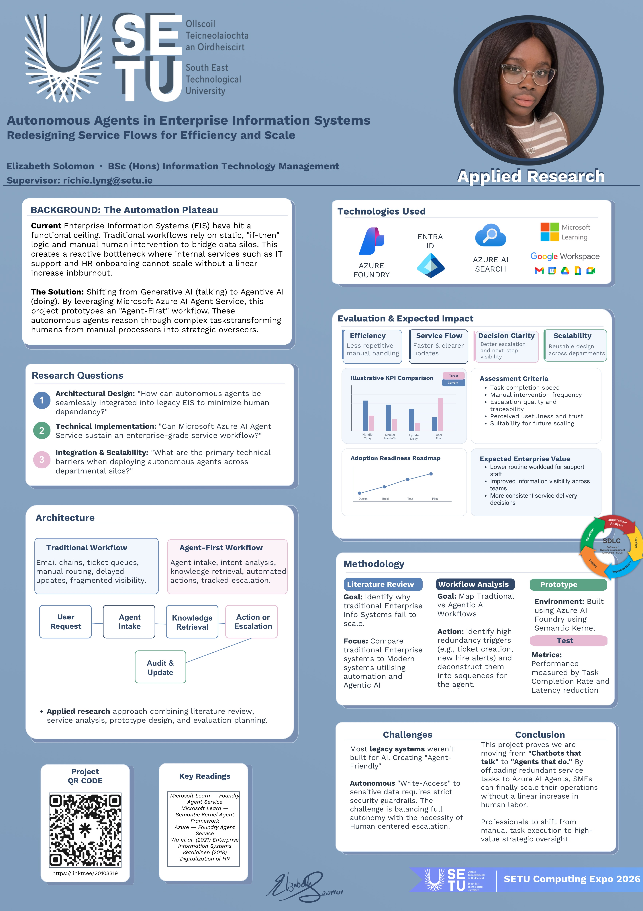

# Redesigning Service Flows with AI Agents - Elizabeth Solomon

### Abstract

My project explores how autonomous AI agents can improve enterprise information systems by automating repetitive internal service tasks, reducing manual workload, and making workflows faster, clearer, and more scalable. Using Microsoft Azure AI Agent Service, I am building a prototype agent-based workflow, likely for onboarding or IT support, to evaluate its impact on efficiency, communication, and user experience, while also examining the challenges of integrating agentic AI into business environments.

| | |
|-------|-------|
| **Project Number** | 50 |
| **Student Name** | Elizabeth Solomon |
| **Student ID** | W20103319 |
| **Supervisor** | Richie Lyng |
| **Project Title** | Redesigning Service Flows with AI Agents |
| **Landing Page** | https://linktr.ee/20103319 |
| **Programme** | BSc in Information Technology Management |

