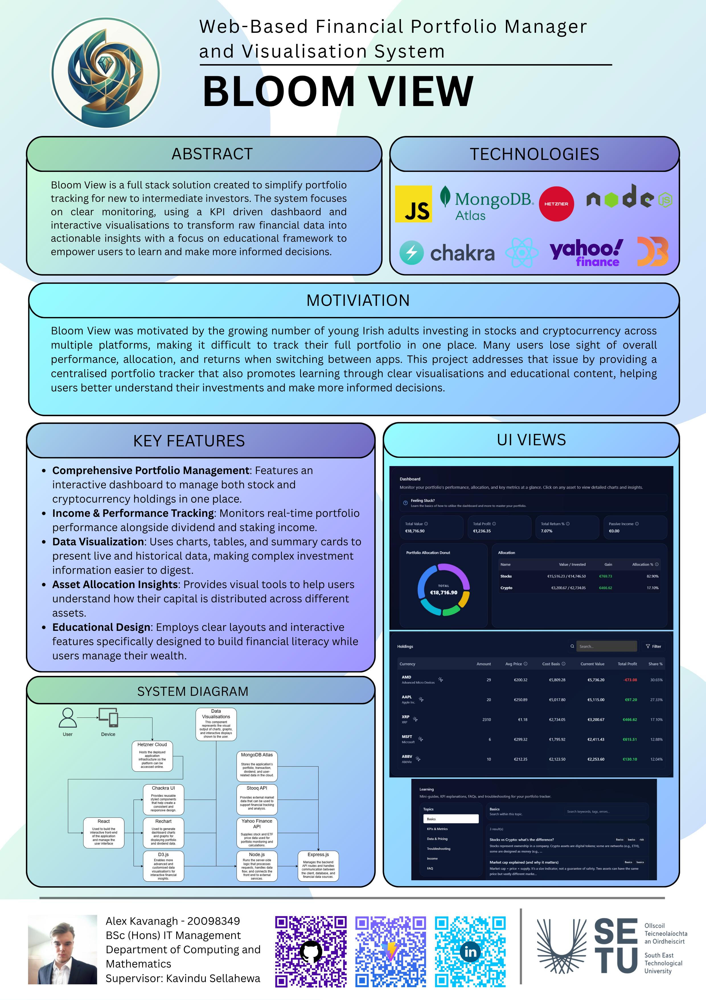

## Bloom View - Alex Kavanagh

### Abstract

Bloom View is a full stack solution created to simplify portfolio tracking for new to intermediate investors. The system focuses on clear monitoring, using a KPI driven dashbaord and interactive visualisations to transform raw financial data into actionable insights with a focus on educational framework to empower users to learn and make more informed decisions. 

Beyond just tracking numbers, it is built on an educational framework designed to empower you. The goal is to give you the context you need to learn as you go, helping you make much more informed decisions without the usual stress.

| | |
|-------|-------|
| **Project Number** | 48 |
| **Student Name** | Alex Kavanagh |
| **Student ID** | W20098349 |
| **Supervisor** | Kavindu Sellahewa |
| **Project Title** | Bloom View |
| **Landing Page** | https://github.com/AlexKav47/Financial-Portfolio-Tracker/tree/main |
| **Programme** | BSc in Information Technology Management |

