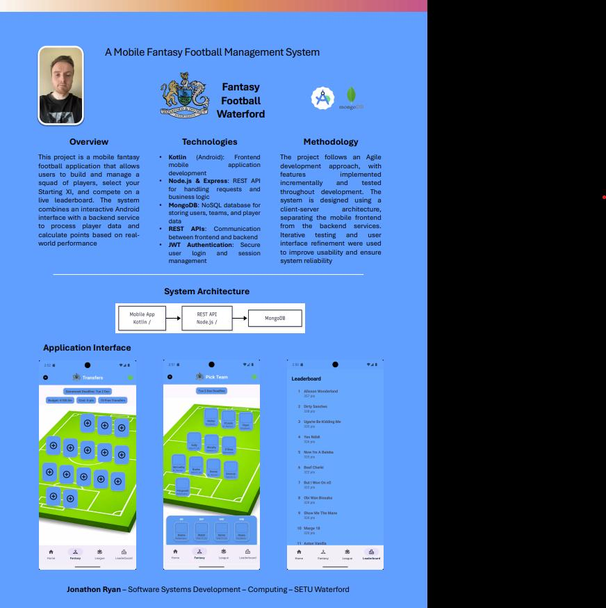

## Fantasy Football Waterford - Jonathon Ryan

### Abstract

A mobile fantasy football application where users can select and manage a squad of players, select their Starting XI and compete on a live leaderboard. The system combines an interactive Android interface with a backend service to calculate points based on real-world performance. Users can sign up to the application, name their team, and may "Transfer" players in and out each week based on their preferences. Points will be updated by the admin for each player, depending on their performance (Goals, Assists etc), each week as games are played in the local Waterford Junior Football League.

| | |
|-------|-------|
| **Project Number** | 68 |
| **Student Name** | Jonathon Ryan |
| **Student ID** | W20101393 |
| **Supervisor** | Jacqui Woods O'Brien |
| **Project Title** | Fantasy Football Waterford |
| **Landing Page** | https://github.com/jonoryan42/fantasy-football-app |
| **Programme** | BSc in Software Systems Development |

