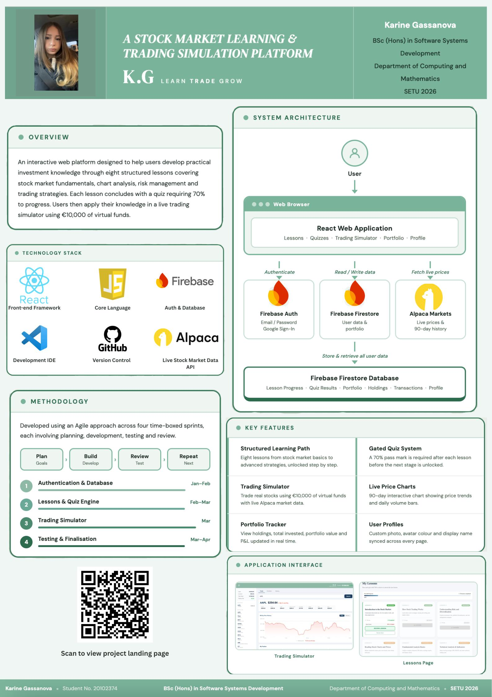

## Stock Market Learning-Trading Simulator - Karina Gassanova

### Abstract

Learn Trade Grow is a full-stack web application designed to teach users the fundamentals of investing through structured lessons and quizzes that assess their understanding. The platform provides a safe, risk-free environment where users can practise real trading using a virtual simulator powered by live market data.  Eight lessons guide users from stock market basics through to advanced trading strategies, each gated by a 70% quiz pass mark. Users then apply their knowledge by buying and selling real stocks using virtual funds via the Alpaca Markets API.

| | |
|-------|-------|
| **Project Number** | 59 |
| **Student Name** | Karina Gassanova |
| **Student ID** | W20102374 |
| **Supervisor** | Deirdre O'Halloran |
| **Project Title** | Stock Market Learning-Trading Simulator |
| **Landing Page** | https://karinagassanova.github.io/stock-learning-app |
| **Programme** | BSc in Software Systems Development |

