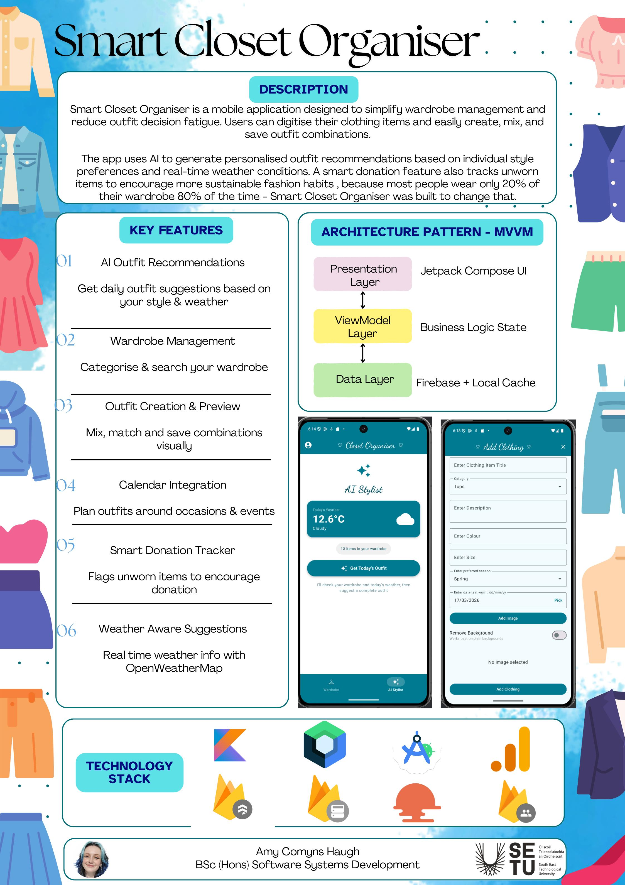

# Smart Closet Organiser - Amy Comyns Haugh

### Abstract

Smart Closet Organiser is a mobile application designed to simplify wardrobe management and reduce outfit decision fatigue. Users can digitise clothing items and easily create, mix, and save outfit combinations. The app uses Gemini AI to generate personalised outfit recommendations based on individual style preferences and real-time weather conditions. A smart donation feature tracks unworn items to encourage sustainable fashion habits, addressing the fact that most people wear only 20% of their wardrobe 80% of the time.

| | |
|-------|-------|
| **Project Number** | 55 |
| **Student Name** | Amy Comyns Haugh |
| **Student ID** | W20103780 |
| **Supervisor** | David Drohan |
| **Project Title** | Smart Closet Organiser |
| **Landing Page** | https://amycomynshaugh03.github.io/Smart-Closet-Organiser/ |
| **Programme** | BSc in Software Systems Development |

