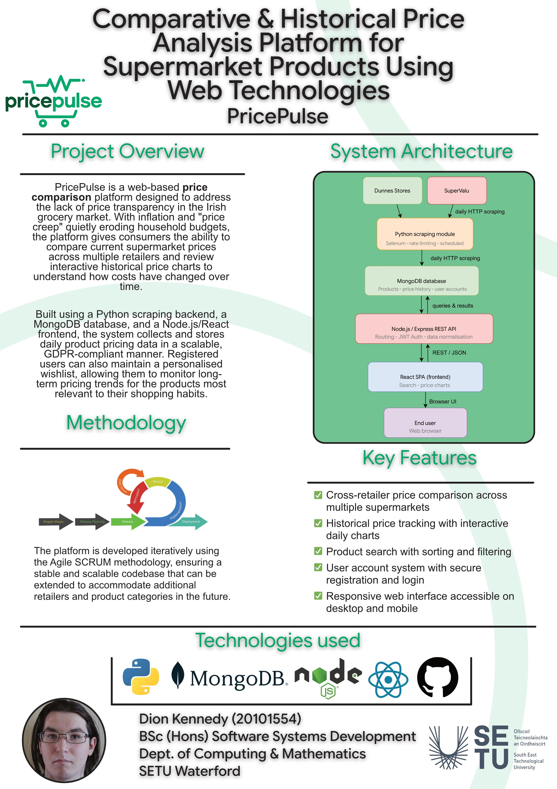

## PricePulse - Dion Kennedy

### Abstract

This project tackles the issue of **price creep**: the subtle, compounding rise in everyday grocery costs that most shoppers will never notice. I built a full-stack web platform that automatically scrapes supermarket prices daily from Irish retailers and displays them historically using charts, letting users track how prices evolve over time. The platform features interactive charts, cross-retailer comparisons, and a personalised wishlist. It turns raw retail data into clear, easy-to-understand information for budget-conscious consumers.

| | |
|-------|-------|
| **Project Number** | 61 |
| **Student Name** | Dion Kennedy |
| **Student ID** | W20101554 |
| **Supervisor** | Dr Rahul Mhapsekar |
| **Project Title** | PricePulse |
| **Landing Page** | https://tiredwork.github.io/final-year-project/ |
| **Programme** | BSc in Software Systems Development |

