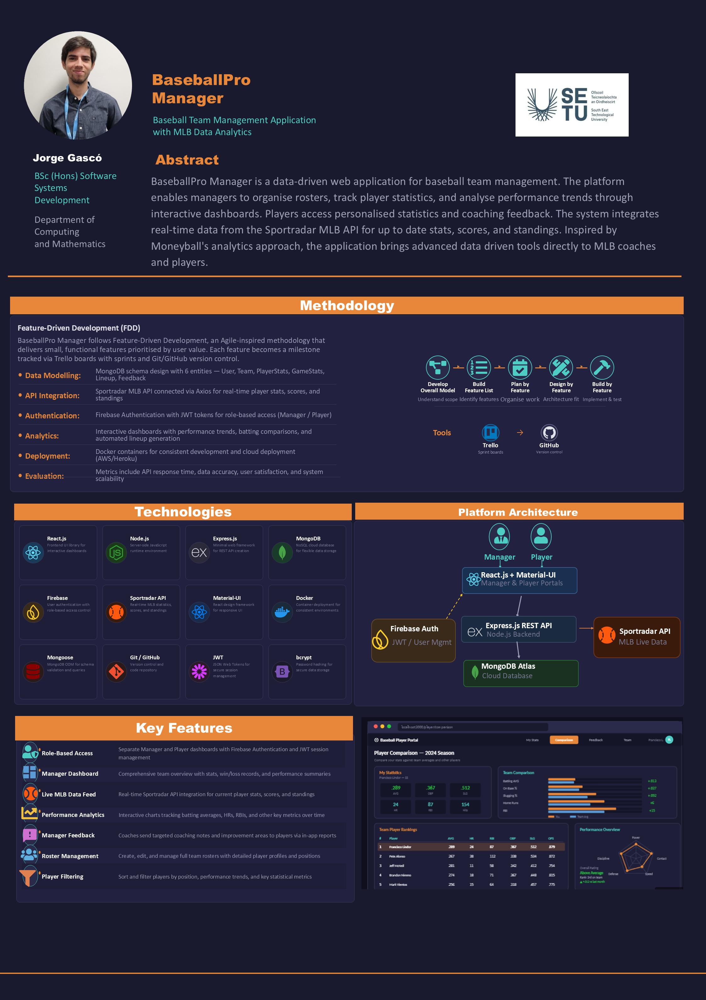

# BaseballPro Manager - Jorge Gasco

### Abstract

BaseballPro Manager is a data-driven web application designed for baseball team management. The platform provides two distinct user roles: Managers access comprehensive team statistics, analyse player performance metrics, generate optimal batting lineups, and send coaching feedback. Players view personalised dashboards tracking their batting averages, home runs, RBIs, and other key metrics over time. The system integrates real-time data from the Sportradar MLB API, delivering current player statistics, game scores, and league standings.

| | |
|-------|-------|
| **Project Number** | 58 |
| **Student Name** | Jorge Gasco |
| **Student ID** | W20099103 |
| **Supervisor** | Kurt Pumares |
| **Project Title** | BaseballPro Manager |
| **Landing Page** | https://jordigasco.github.io/FYPwebsite/ |
| **Programme** | BSc in Software Systems Development |

