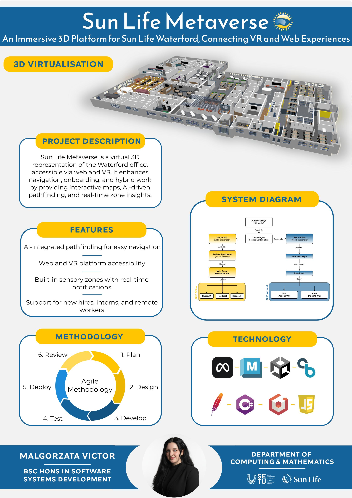

# Sun Life Metaverse - Malgorzata Victor

### Abstract

**Sun Life Metaverse** is an immersive project that creates a virtual 3D representation of the Waterford office, accessible via web and VR. It addresses challenges in navigation, onboarding, and hybrid work by providing an interactive map, AI-driven pathfinding, and real-time insights. The solution improves employee experience, supports new hires, connects remote and onsite staff, and demonstrates innovative use of *VR*, *3D mapping*, and *digital twin technology* in a modern corporate environment.

| | |
|-------|-------|
| **Project Number** | 71 |
| **Student Name** | Malgorzata Victor |
| **Student ID** | W20102772 |
| **Supervisor** | Sonya Hogan |
| **Project Title** | Sun Life Metaverse |
| **Landing Page** | https://malgorzatavictor.github.io/ |
| **Programme** | BSc in Software Systems Development |

