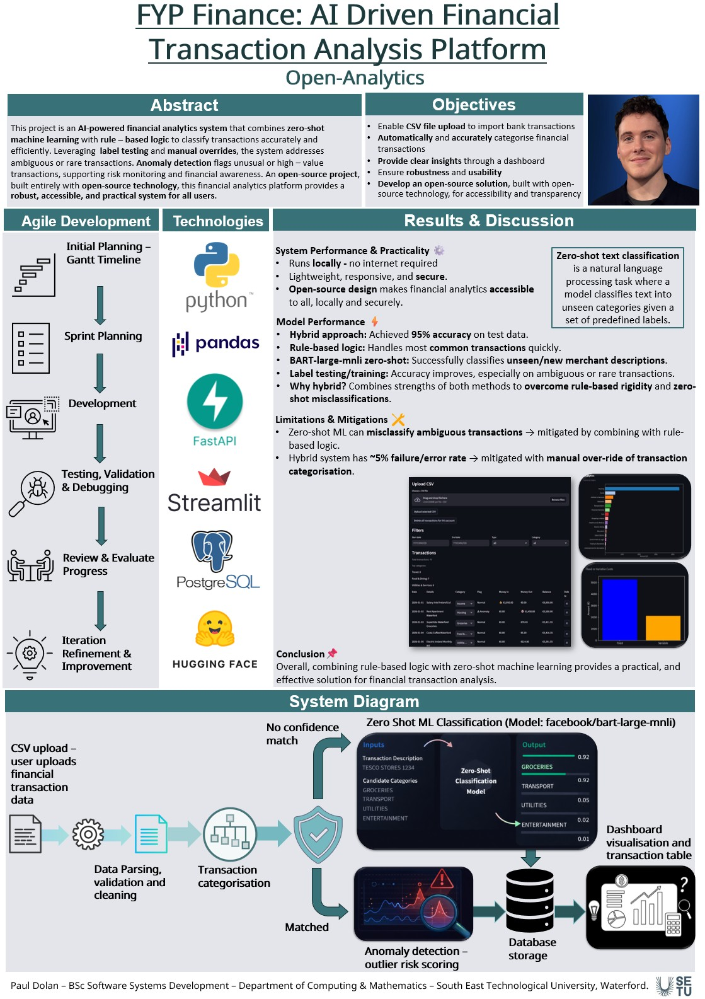

# Open Analytics - Paul Dolan

### Abstract

This project presents a locally deployed financial analytics platform for personal and business data. The system processes real bank CSV files, automatically categorises transactions using a hybrid approach combining rule based logic and machine learning, and identifies unusual spending patterns. Designed with a privacy first approach, all processing occurs locally without external data sharing, providing a simple and accessible way for users to better understand and manage their finances, while maintaining full control over their data.

| | |
|-------|-------|
| **Project Number** | 56 |
| **Student Name** | Paul Dolan |
| **Student ID** | W20096590 |
| **Supervisor** | Michael McMahon |
| **Project Title** | Open Analytics |
| **Landing Page** | https://github.com/PaulsGitH/fyp-open-source-finance-analytics |
| **Programme** | BSc in Software Systems Development |

