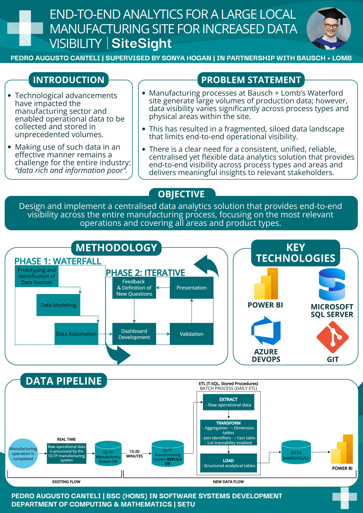

## {SiteSight} - Pedro Augusto Canteli

### Abstract

Technological advancements have enabled operational data to be collected and stored at unprecedented volumes. However, effectively leveraging this data remains a challenge across the manufacturing industry. At Bausch + Lomb’s Waterford site, data exists across multiple platforms with varying levels of maturity, structure, and reporting practices, resulting in a fragmented data landscape. This project addresses these challenges by unifying these capabilities through a centralised analytics solution, enabling consistent, end-to-end visibility across the manufacturing process.

| | |
|-------|-------|
| **Project Number** | 54 |
| **Student Name** | Pedro Augusto Canteli |
| **Student ID** | W20103533 |
| **Supervisor** | Sonya Hogan |
| **Project Title** | {SiteSight} |
| **Landing Page** | https://site-sight.netlify.app |
| **Programme** | BSc in Software Systems Development |

