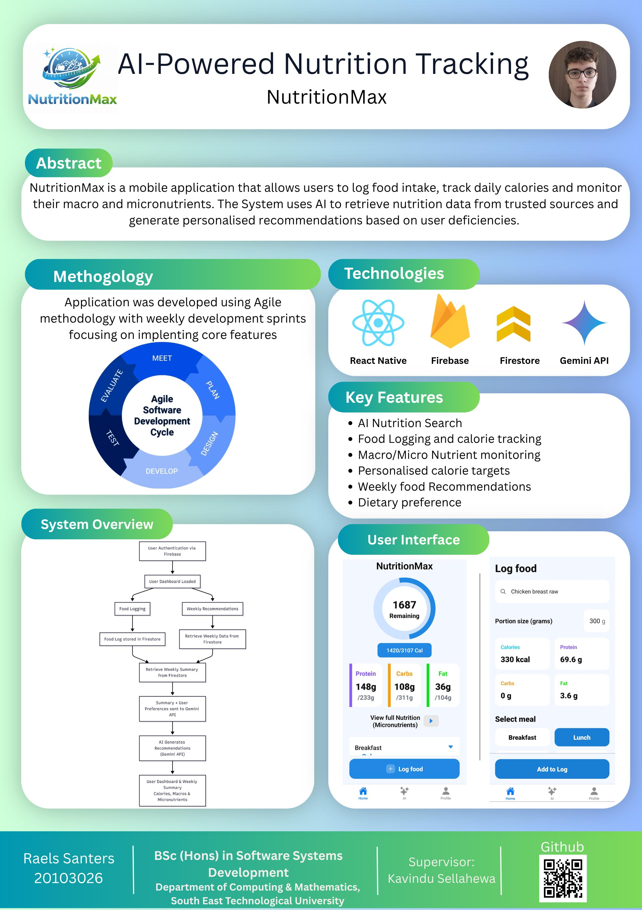

# NutritionMax - Raels Santers

### Abstract

NutritionMax is a mobile application that allows users to log their food intake, track daily calories and monitor their macronutrients and micronutrients. The System uses AI to retrieve nutritional food data from trusted sources and generate personalised food recommendations based on user deficiencies while taking into account their dietary preferences. This application provides users with deep insights into their dietary lifestyle, to help them make the best choices to reach their fitness goals.

| | |
|-------|-------|
| **Project Number** | 69 |
| **Student Name** | Raels Santers |
| **Student ID** | W20103026 |
| **Supervisor** | Kavindu Sellahewa |
| **Project Title** | NutritionMax |
| **Landing Page** | https://raels24.github.io/nutritionmax-showcase/ |
| **Programme** | BSc in Software Systems Development |

