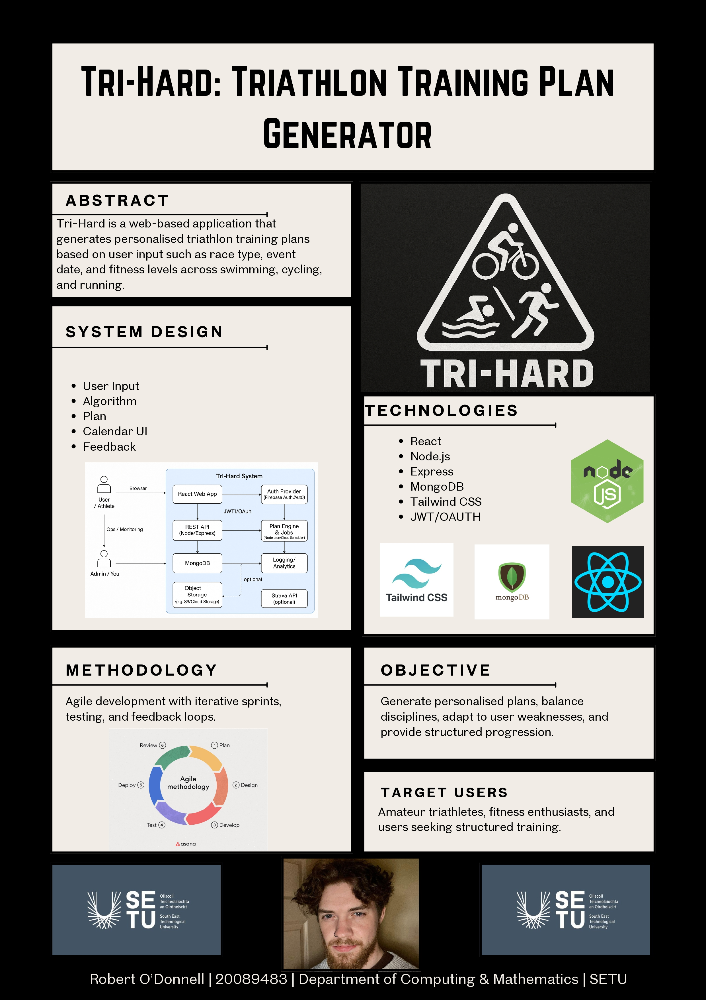

# Tri-Hard - Robert ODonnell

### Abstract

Tri-Hard is a web-based application that generates personalised triathlon training plans using user inputs such as event type, race date, weekly availability, and ability across swimming, cycling, and running. The system produces structured and balanced schedules based on progressive training principles to support safe and effective improvement. Designed with simplicity and accessibility in mind, Tri-Hard provides an affordable and user-friendly alternative to complex or subscription-based coaching platforms.

| | |
|-------|-------|
| **Project Number** | 66 |
| **Student Name** | Robert ODonnell |
| **Student ID** | W20089483 |
| **Supervisor** | Brenda O'Neill |
| **Project Title** | Tri-Hard |
| **Landing Page** | https://github.com/robertodonnell00/tri-hard.git |
| **Programme** | BSc in Software Systems Development |

