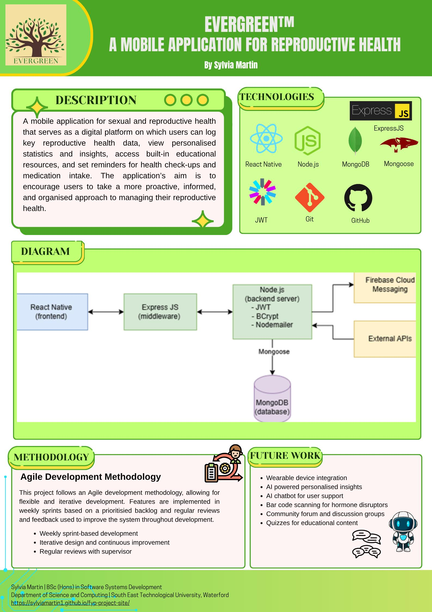

## Evergreen Mobile - Sylvia Martin

### Abstract

A mobile application for sexual and reproductive health that caters to menstruating women, women who are undergoing or have undergone menopause, and men. It serves as a digital platform on which users can log key reproductive health data, view personalised statistics and insights, access built-in educational resources, and receive daily reminders to log their health data. The application’s aim is to encourage users to take a more proactive, informed, and organised approach to managing their reproductive health.

| | |
|-------|-------|
| **Project Number** | 63 |
| **Student Name** | Sylvia Martin |
| **Student ID** | W20102981 |
| **Supervisor** | Sonya Hogan |
| **Project Title** | Evergreen Mobile |
| **Landing Page** | https://sylviamartin1.github.io/fyp-project-site/ |
| **Programme** | BSc in Software Systems Development |

