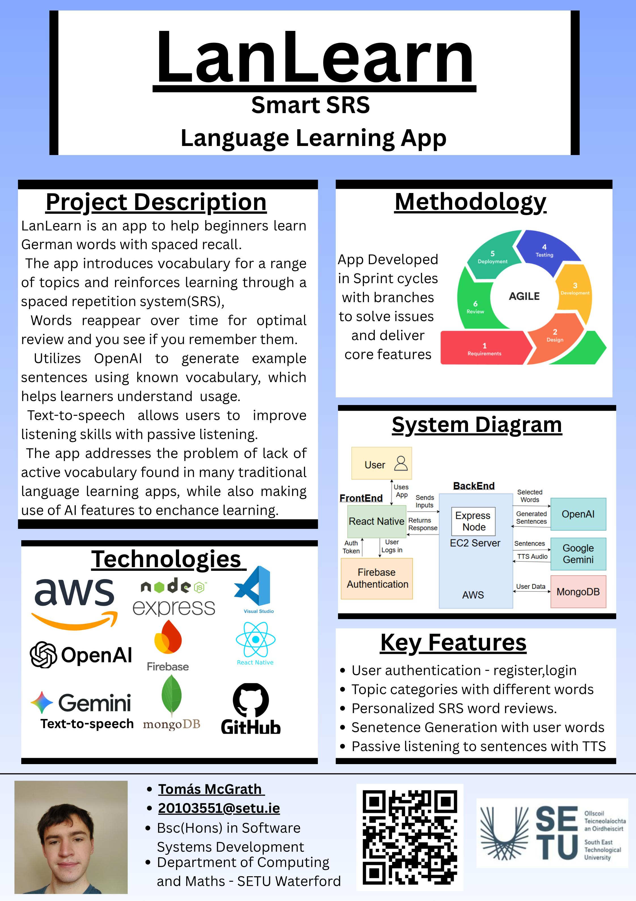

## LanLearn - Tomás McGrath

### Abstract

This project is a React Native language learning app to help beginners learn German. It uses spaced repetition flashcards to review vocabulary, AI generated sentences for practical usage of learned vocabulary, and text to speech for passive listening. Users progress is saved to accounts secured with Firebase and MongoDB. The app aims to provide an engaging and personalized learning experience, while also offering an alternative to traditional language learning apps rigid structure and also making use of AI features to help supplement what they have learned.

| | |
|-------|-------|
| **Project Number** | 64 |
| **Student Name** | Tomás McGrath |
| **Student ID** | W20103551 |
| **Supervisor** | Deirdre O'Halloran |
| **Project Title** | LanLearn |
| **Landing Page** | https://tomasmcg.github.io/FYP-Website/ |
| **Programme** | BSc in Software Systems Development |

