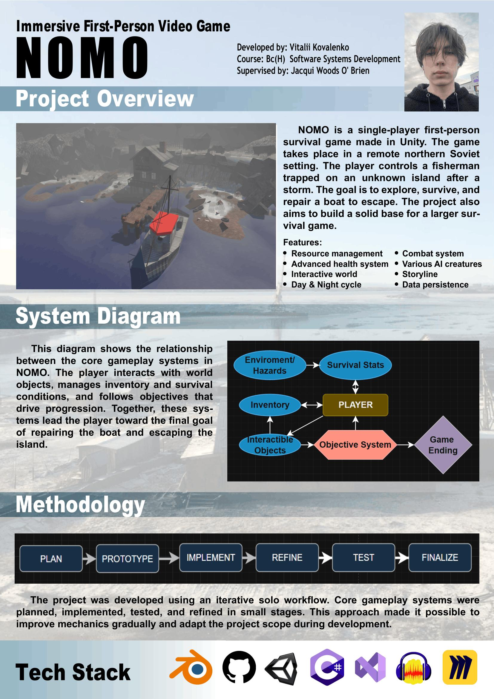

# NOMO - Vitalii Kovalenko

### Abstract

NOMO is a single-player first-person survival game developed in Unity and set in a remote northern Soviet environment. The player takes on the role of a fisherman stranded on an isolated island after a violent storm. To survive, the player must explore the world, manage hunger, hydration, energy and temperature, collect resources, and interact with the environment. The long-term objective is to repair a damaged boat and escape the island, while uncovering the atmosphere and mystery of the setting.

| | |
|-------|-------|
| **Project Number** | 62 |
| **Student Name** | Vitalii Kovalenko |
| **Student ID** | W20103720 |
| **Supervisor** | Jacqui Woods O'Brien |
| **Project Title** | NOMO |
| **Landing Page** | https://manyakasia.itch.io/nomo |
| **Programme** | BSc in Software Systems Development |

