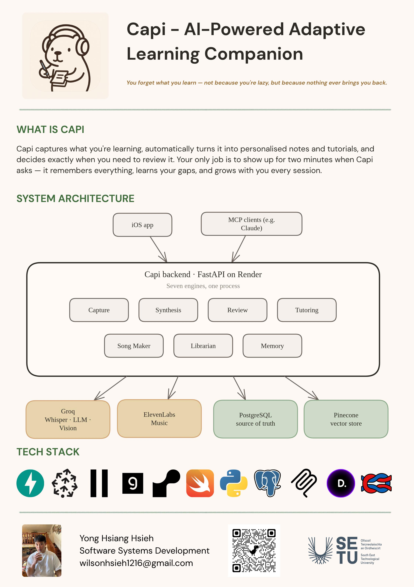

# Capi - Yong Hsiang Hsieh

### Abstract

**Capi** is an AI-powered, mobile-first iOS learning companion that helps students retain what they learn. Most of what students learn is gone within a day, not for lack of effort but because nothing brings them back. Capi does. It schedules spaced review, runs short active-recall sessions when concepts are due, and pulls related concepts with each one. Students only have to show up. Capi captures the lecture, the slides, and imports from their other tools. A memory of each student builds over time, so each session is better than the last.

| | |
|-------|-------|
| **Project Number** | 60 |
| **Student Name** | Yong Hsiang Hsieh |
| **Student ID** | W20100776 |
| **Supervisor** | Diarmuid O'Connor |
| **Project Title** | Capi |
| **Landing Page** | https://www.capi.lol/ |
| **Programme** | BSc in Software Systems Development |

