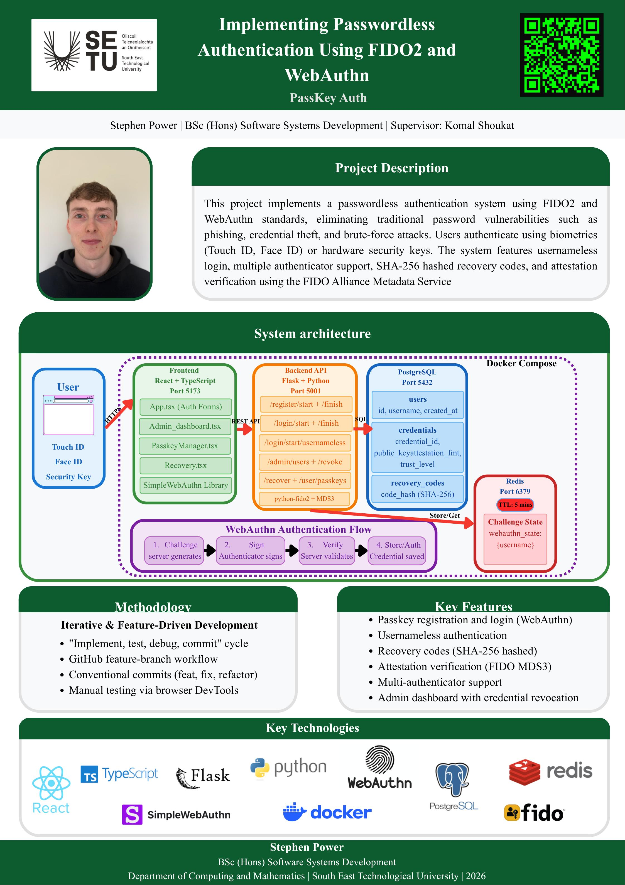

# PassKey Auth - Stephen Power

### Abstract

This project implements a passwordless authentication system using {FIDO2} and {WebAuthn} standards, eliminating phishing, credential theft, and brute-force attacks. Users authenticate via biometrics (Touch ID, Face ID) or hardware security keys. Features include usernameless login, multi-authenticator support, SHA-256 hashed recovery codes, and FIDO MDS3 attestation verification. The frontend uses React, TypeScript, and Vite. The backend runs Flask with python-fido2. PostgreSQL stores credentials, Redis manages session state, and Docker Compose orchestrates all services.

| | |
|-------|-------|
| **Project Number** | 67 |
| **Student Name** | Stephen Power |
| **Student ID** | W20098263 |
| **Supervisor** | Komal Shoukat |
| **Project Title** | PassKey Auth |
| **Landing Page** | https://www.passwordlessauth.net/ |
| **Programme** | BSc in Software Systems Development |

