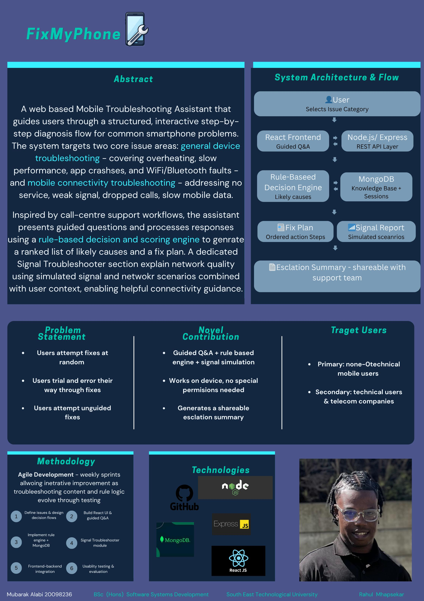

# {FixMyPhone} Phone Troubleshooting Guide - Mubarak Alabi

### Abstract

FixMyPhone is a web-based mobile troubleshooting assistant that guides users through a structured, step-by-step diagnosis flow for common smartphone problems. Users select an issue category and answer a series of guided questions. A rule-based scoring engine analyses their responses to identify the most likely cause and generate a personalised fix plan. The system covers general device issues such as performance, battery, and app crashes, as well as mobile connectivity problems including weak signal and no service. Inspired by call-centre support workflows.

| | |
|-------|-------|
| **Project Number** | 65 |
| **Student Name** | Mubarak Alabi |
| **Student ID** | W20098236 |
| **Supervisor** | Dr Rahul Mhapsekar |
| **Project Title** | {FixMyPhone} Phone Troubleshooting Guide |
| **Landing Page** | https://mubarak09.github.io/FixMyPhone-Phone-Troubleshooting-Guide/ |
| **Programme** | BSc in Software Systems Development |

