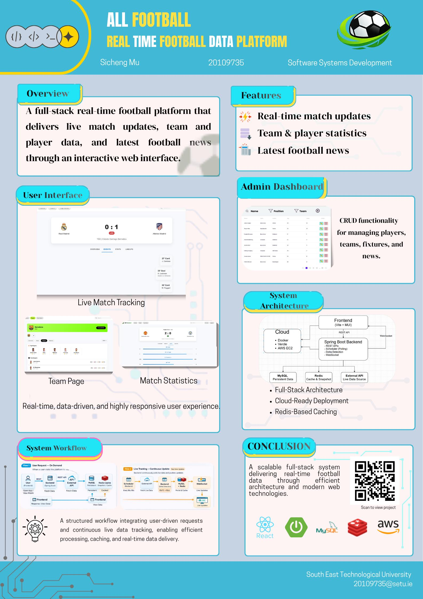

# All Football: Real-Time Platform - Sicheng Mu

### Abstract

This project presents the design and implementation of a full-stack real-time football data platform. It integrates live match updates, team and player statistics, and news into a single web application. The backend is built with Spring Boot, using scheduled polling and delta detection to process live data from external {API} sources. Redis is used for caching, while MySQL provides persistent storage. A React-based frontend delivers an interactive user interface, with real-time updates enabled through WebSocket communication.

| | |
|-------|-------|
| **Project Number** | 70 |
| **Student Name** | Sicheng Mu |
| **Student ID** | W20109735 |
| **Supervisor** | Dr Malik Faizan |
| **Project Title** | All Football: Real-Time Platform |
| **Landing Page** | https://github.com/musicheng520/All-Football-Backend |
| **Programme** | BSc in Software Systems Development |

