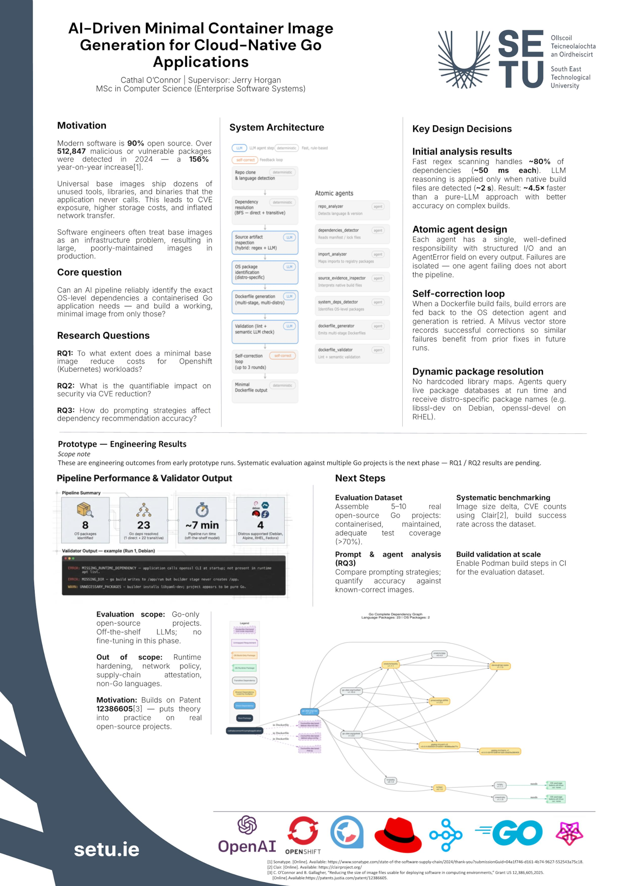

## AI Optimised Container Images - Cathal O'Connor

### Abstract

This proposal explores using AI agents to generate minimal container base images for microservices, aiming to reduce security risks and cloud costs. Current images include unnecessary dependencies, increasing CVEs and resource usage. The research designs an AI-driven pipeline to identify only required components, then evaluates impacts on image size, costs, and vulnerabilities. It also examines how prompt engineering affects accuracy, contributing a practical framework for improving container security and efficiency.

| | |
|-------|-------|
| **Project Number** | 112 |
| **Student Name** | Cathal O'Connor |
| **Student ID** | W20005581 |
| **Supervisor** | Jerry Horgan |
| **Project Title** | AI Optimised Container Images |
| **Landing Page** | https://github.com/CathalOConnorRH/MastersThesis |
| **Programme** | MSc in Enterprise Software Systems |

