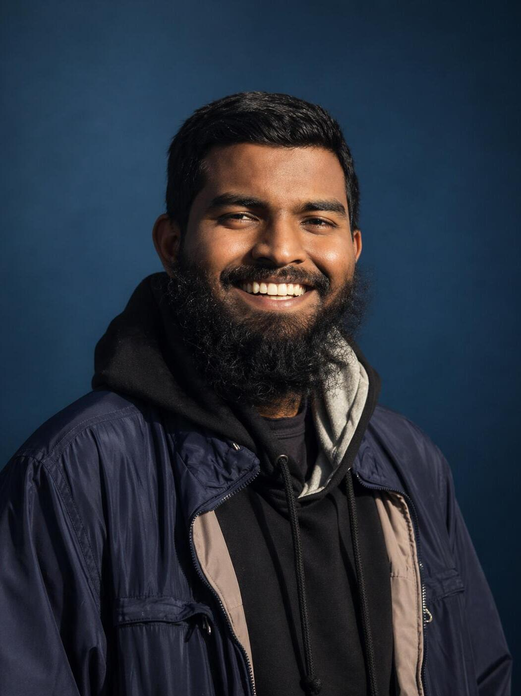

## Multi-Angle Ultrasound Reconstruction - Kazi Md Al Wakil

### Abstract

Ultrasound imaging is widely used due to its real-time capability and safety, but multi-angle acquisitions often suffer from misalignment caused by probe motion and tissue deformation. This project proposes DeepUS-ReconSeg++, a unified deep learning framework that performs deformable registration, transformer-based cross-angle fusion, and joint reconstruction and segmentation. The model improves image quality and segmentation accuracy while incorporating uncertainty estimation and explainability, enabling more reliable and robust analysis for clinical ultrasound applications.

| | |
|-------|-------|
| **Project Number** | 119 |
| **Student Name** | Kazi Md Al Wakil |
| **Student ID** | W20115749 |
| **Supervisor** | Dr Lizy Abraham |
| **Project Title** | Multi-Angle Ultrasound Reconstruction |
| **Landing Page** | https://github.com/kazimdalwakil/Msc-Thesis-SETU-.git |
| **Programme** | MSc in Enterprise Software Systems |

