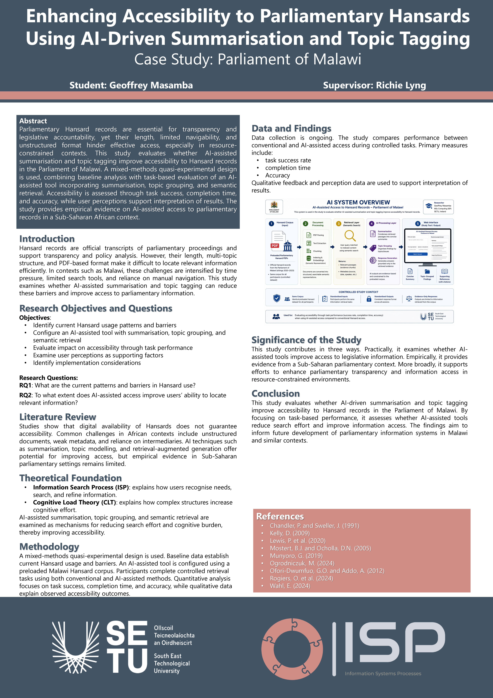

# Improving Accessibility to Hansards - Geoffrey Masamba

### Abstract

This project explores how AI can improve access to parliamentary Hansards in the Parliament of Malawi. Long, unstructured transcripts are difficult for MPs and staff to quickly find relevant debates and statements. The study uses an existing AI agent with Retrieval Augmented Generation (RAG) to compare traditional document search with AI-assisted summarisation and topic-based retrieval. Using task-based evaluation, surveys and interviews, the project measures efficiency, usability and user acceptance, showing how AI can support evidence-based decision-making in low-resourced parliaments.

| | |
|-------|-------|
| **Project Number** | 128 |
| **Student Name** | Geoffrey Masamba |
| **Student ID** | W20115492 |
| **Supervisor** | Richie Lyng |
| **Project Title** | Improving Accessibility to Hansards |
| **Landing Page** | https://github.com/20115492/hansard-ai-acess |
| **Programme** | MSc in Information Systems Processes |

