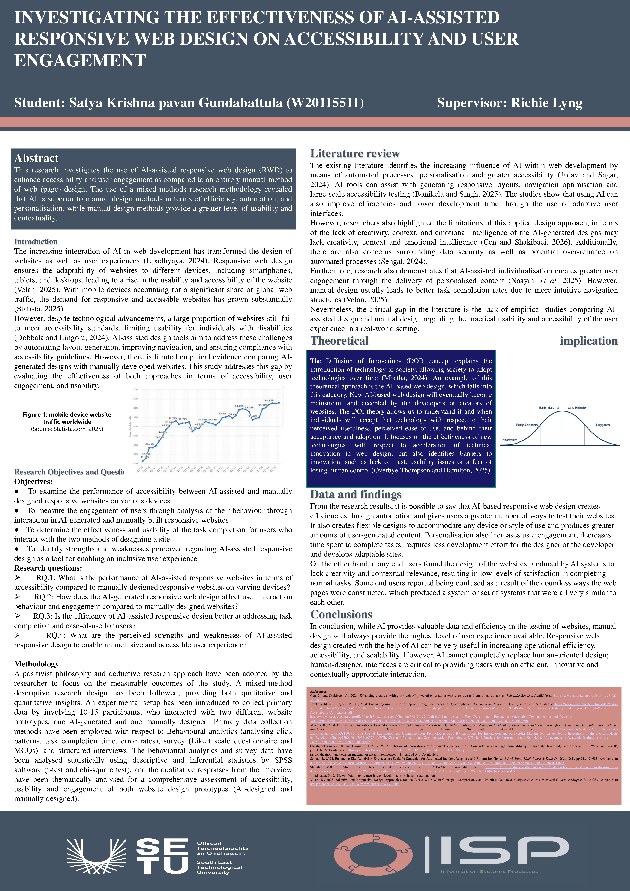

## AI vs Manual Web Design - Satya Krishna Pavan Gundabattula

### Abstract

This project explores how AI-assisted tools are influencing the way responsive websites are designed and whether they truly improve accessibility and user experience compared to traditional manual approaches. It looks at how websites perform across different devices, how users interact with them, and how efficiently they complete common tasks. By comparing both methods, the study highlights their strengths and limitations, and shows how combining AI capabilities with human design thinking can lead to more practical, accessible, and user-friendly web solutions.

| | |
|-------|-------|
| **Project Number** | 123 |
| **Student Name** | Satya Krishna Pavan Gundabattula |
| **Student ID** | W20115511 |
| **Supervisor** | Richie Lyng |
| **Project Title** | AI vs Manual Web Design |
| **Landing Page** | https://github.com/PavanG9391/ai-web-accessibility-study |
| **Programme** | MSc in Information Systems Processes |

