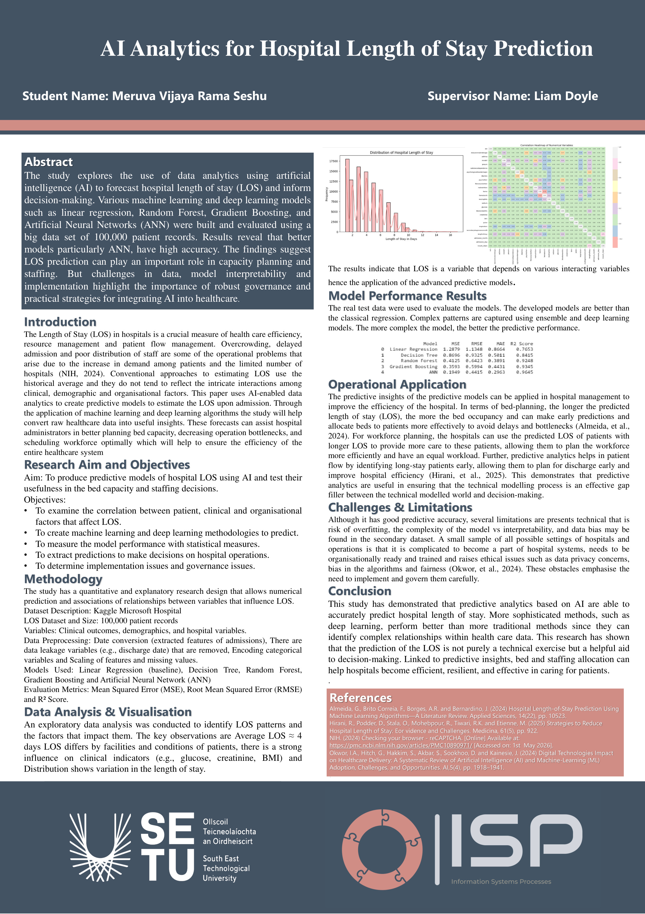

## LOS-AI-Project - Vijaya Rama Seshu Meruva

### Abstract

This project explores how AI-powered data analytics can be used to predict how long patients are likely to stay in hospital. The focus is not only on building accurate prediction models but also on showing how these predictions can help hospitals make better decisions about bed capacity, patient flow, and staffing levels. It also examines the technical, organizational, and ethical challenges of using AI in real hospital settings and suggests practical governance measures for safe and responsible implementation.

| | |
|-------|-------|
| **Project Number** | 129 |
| **Student Name** | Vijaya Rama Seshu Meruva |
| **Student ID** | W20115923 |
| **Supervisor** | Lyam Doyle |
| **Project Title** | LOS-AI-Project |
| **Landing Page** | https://github.com/ramaseshu-Data/LOS-AI-Project |
| **Programme** | MSc in Information Systems Processes |

