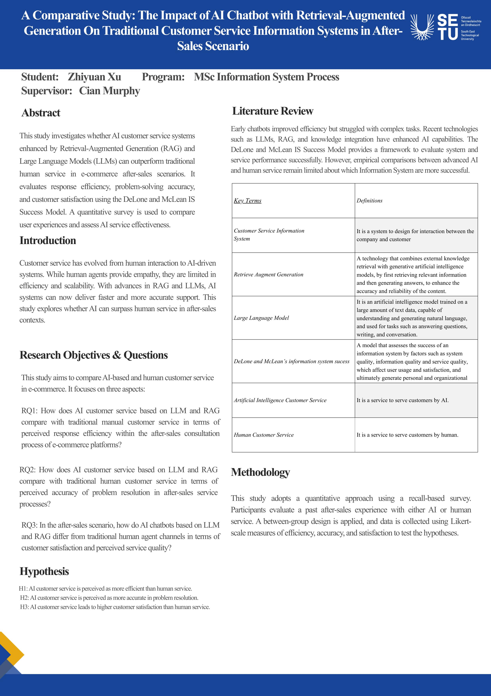

## AI Customer Service vs Human Support - Zhiyuan Xu

### Abstract

This project explores the effectiveness of AI-powered customer service systems based on Large Language Models (LLMs) and Retrieval-Augmented Generation (RAG) in e-commerce after-sales scenarios. It compares AI chatbots with traditional human service using the DeLone and McLean Information System Success Model. A quantitative survey is conducted to evaluate response efficiency, problem-solving accuracy, and customer satisfaction. The study aims to provide empirical evidence on whether AI systems can enhance service performance and compare user experience in complex after-sales interactions.

| | |
|-------|-------|
| **Project Number** | 135 |
| **Student Name** | Zhiyuan Xu |
| **Student ID** | W20115990 |
| **Supervisor** | Cian Murphy |
| **Project Title** | AI Customer Service vs Human Support |
| **Landing Page** | https://github.com/Frankie222222222222/A-Comparative-Study.git |
| **Programme** | MSc in Information Systems Processes |

