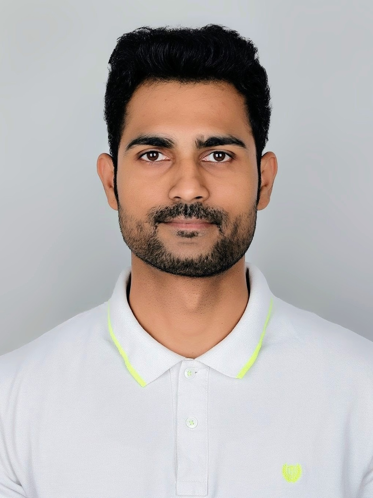

## Better Agile, Better Delivery - Roshan Khamkar

### Abstract

Agile grew fast but still more than half of agile projects run late or over budget due to requirement issues. This research looks at how collaborative modelling techniques like user story mapping and event storming help close the gap between what stakeholders want and what teams deliver. Using surveys and interviews, the study looks at how human factors, team culture and communication affect requirements gathering. The goal is to give agile teams useful tools to complete projects more successfully and keep stakeholders happy.

| | |
|-------|-------|
| **Project Number** | 126 |
| **Student Name** | Roshan Khamkar |
| **Student ID** | W20115908 |
| **Supervisor** | Cian Murphy |
| **Project Title** | Better Agile, Better Delivery |
| **Landing Page** | https://github.com/Ross17/Collaborative-Modelling-Techniques-for-Enhancing-Requirements-Elicitation-in-Agile-Process |
| **Programme** | MSc in Information Systems Processes |

